# Naver Whale
Naver를 참고하여 새로운 로그인, 회원가입, 메인페이지 작업

<br>

## 📣 프로젝트 소개
- 개인 프로젝트
- 새롭게 배운 form 태그를 사용한 로그인, 회원가입 페이지 + 메인 작업물
- 참고 사이트
    1. 네이버 웨일 : https://whale.naver.com/ko/  
    2. 웨일스페이스 : https://whalespace.io  
    3. 네이버 로그인 : https://nid.naver.com/nidlogin.login?mode=form&rl=https://www.naver.com/  

### 📅 작업 기간
- 2023년 8월 (2주)

### 💻 사용 툴 및 작업 언어
- Adobe XD (디자인)
- Visual Studio Code
    - html, css, javascript, jQuery 

<br>

## 🎮 주요기능
### 반응형

|web|mobile|
|:---:|:---:|
|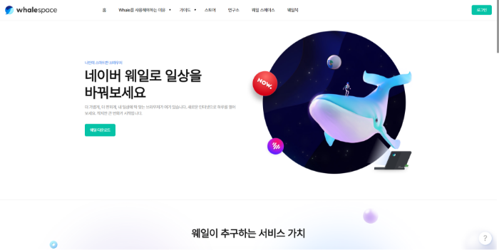|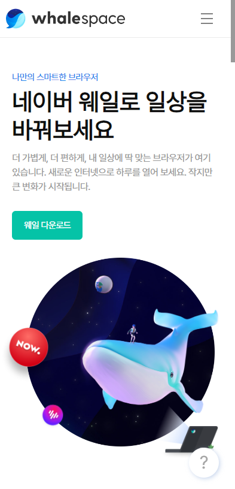|

### 동적 요소
- 공통
  <table>
    <tr>
      <th>우측 하단 빠른 이동 버튼</th>
      <th>딜레마 차이를 둔 애니메이션 효과</th>
    </tr>
    <tr>
      <td></td>
      <td rowspan="4">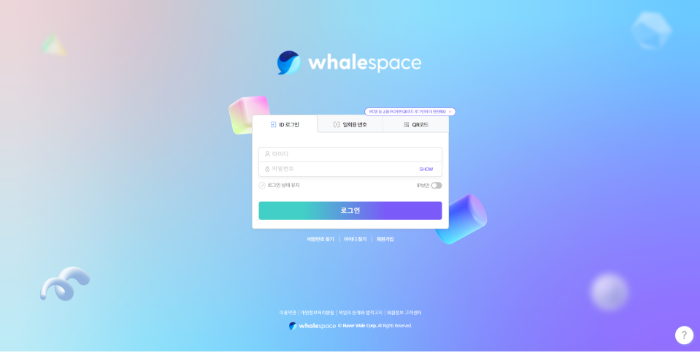</td>
    </tr>
    <tr>
      <td>기본</td>
    </tr>
    <tr>
      <td>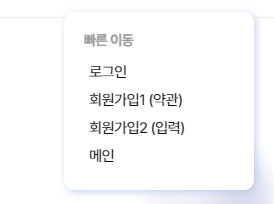</td>
    </tr>
    <tr>
      <td>호버 시</td>
    </tr>
  </table>
    
- 메인
  <table>
    <tr>
      <th>스와이퍼</th>
      <th>지정된 위치 도달 시 플립하는 요소</th>
      <th>탭 버튼</th>
      <th>반응형 메뉴</th>
    </tr>
    <tr>
      <td rowspan="4"></td>
      <td rowspan="4">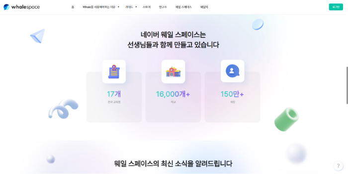</td>
      <td rowspan="4">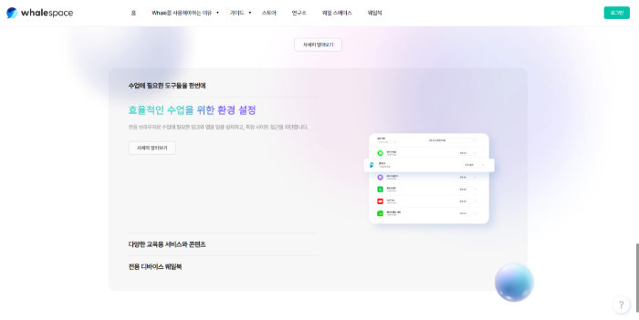</td>
      <td></td>
    </tr>
    <tr>
      <td>web</td>
    </tr>
    <tr>
      <td>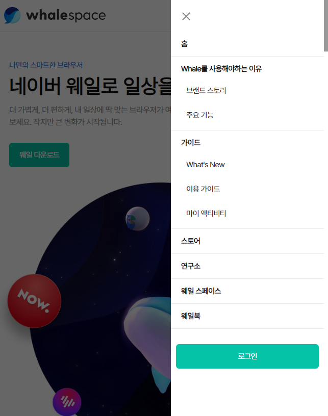</td>
    </tr>
    <tr>
      <td>mb</td>
    </tr>
  </table>

- 로그인
  <table>
    <tr>
      <th>비밀번호 show, hide</th>
      <th>탭 메뉴</th>
      <th>타이머</th>
    </tr>
    <tr>
      <td>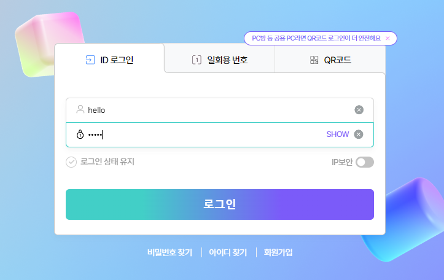</td>
      <td rowspan="4">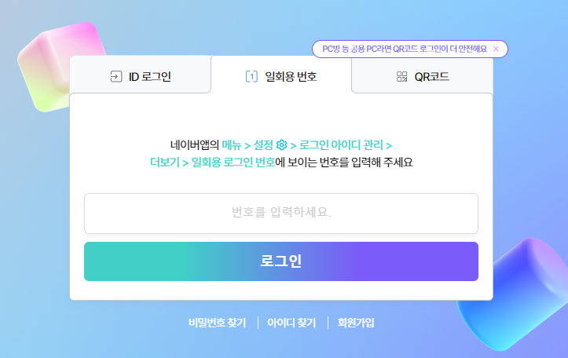</td>
      <td rowspan="4"></td>
    </tr>
    <tr>
      <td>기본 비밀번호 숨김</td>
    </tr>
    <tr>
      <td>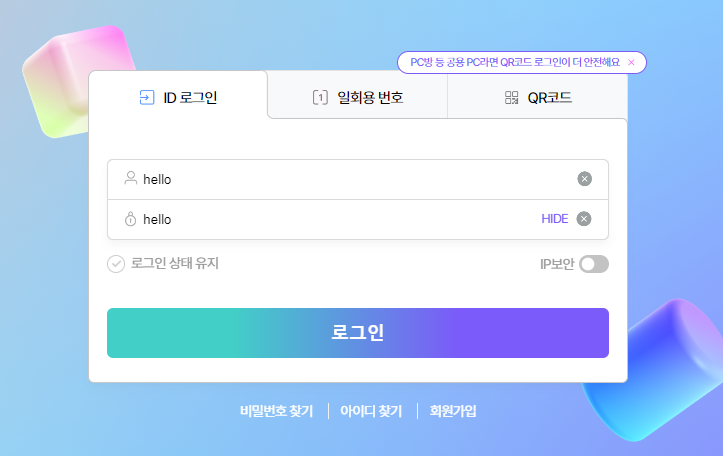</td>
    </tr>
    <tr>
      <td>
        비밀번호 보임
      </td>
    </tr>
  </table>
    
- 회원가입1
  <table>
    <tr>
      <th colspan="2">필수 약관 체크 시 버튼 활성화</th>
    </tr>
    <tr>
      <td></td>
      <td>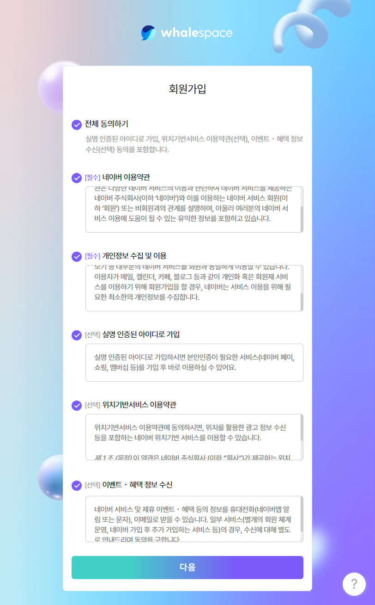</td>
    </tr>
    <tr>
      <td>전</td>
      <td>후</td>
    </tr>
  </table>

- 회원가입2
  <table>
    <tr>
      <th colspan="2">비밀번호 숨김, 보이기</th>
    </tr>
    <tr>
      <td>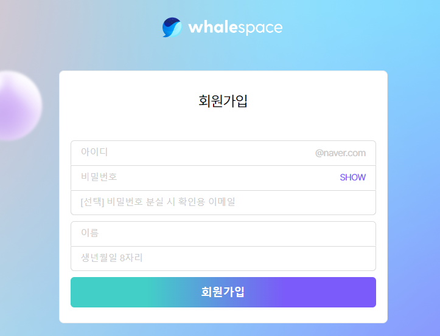</td>
      <td>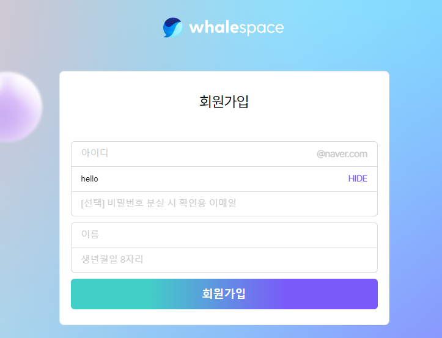</td>
    </tr>
    <tr>
      <td>기본 안보임</td>
      <td>클릭 후 보임</td>
    </tr>
  </table>

<br>

***

## 📌 프로젝트 작업하며 얻은 코드
<details>
  <summary>지정한 위치 도달 시 플립 효과</summary>
  <br>

  1. 현재 스크롤 위치에 스크롤 임계값(scrollHeight)를 더한 것보다 작거나 같은 경우, 코드 실행
  2. animationName 속성 'flip' 사용

      ```javascript
      $(document).ready(function() {
        $(window).scroll(function() {
          let scrollHeight = 400;
          let currentScroll = $(this).scrollTop();

          $('#adoption .adoption_inner .item_container .item_wrap').children('.item_img').each(function() {
            if ($(this).offset().top <= currentScroll + scrollHeight) {
              $(this).css({animationName: 'flip',});
            } else {
              $(this).css({animationName: 'none',});
            }
          });
        });
      });
      ```
</details>

<details>
  <summary>필수 항목 체크 시 버튼 활성화</summary>
  <br>

  1. prop() : HTML 요소의 속성 값을 가져오거나 설정하기 위해 사용된다. 주로 폼 요소, 체크박스, 라디오 버튼, 속성 상태를 다룰 때 사용
  2. trigger() : 특정 DOM 요소에서 정의된 이벤트(ex: click, mouseover, 사용자 지정 이벤트 등)를 강제로 발생

      ```javascript
        $("input.essential").on("change", function() {
            let allChecked = true;
            $("input.essential").each(function() { //선택한 요소들을 하나씩 반복하면서 각 요소에 대해 특정 동작을 수행
              if (!$(this).prop("checked")) {//checked가 아닐 시 false
                allChecked = false;
              }
            });

            if (allChecked) {//allChecked가 true이면
              $("input[type='submit']").removeAttr("disabled").addClass('on');
            } else {
              $("input[type='submit']").attr("disabled", "disabled").removeClass('on');
            }
          });
        $(".essential").trigger("change");    
      ```
</details>

<details>
  <summary>버튼 클릭 시 입력한 비밀번호 show,hide</summary>
  <br>

  1. 클릭 이벤트 if ($("#pw").attr("type") == "password") //#pw의 속성 type이 password면 참
  2. 참일 시 타입을 text로 바꾸고 이벤트 타겟 text는 HIDE로 변경

      ```javascript
        $('.show').on('click',function(){
          if ($("#pw").attr("type") == "password") {
            $("#pw").attr("type", "text");
            $($(this)).text("HIDE");
          } else {
            $("#pw").attr("type", "password");
            $($(this)).text("SHOW");
          }
        });
      ```
</details>